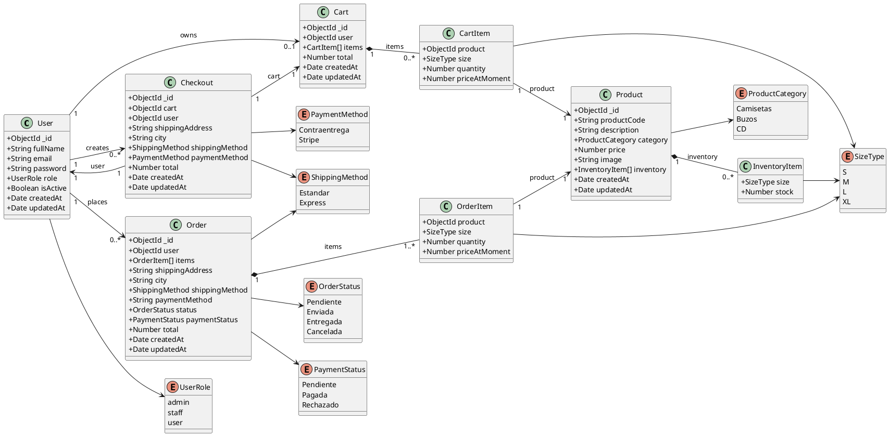

```plantuml
@startuml
left to right direction
skinparam classAttributeIconSize 0

class User {
  +ObjectId _id
  +String fullName
  +String email
  +String password
  +UserRole role
  +Boolean isActive
  +Date createdAt
  +Date updatedAt
}

class Product {
  +ObjectId _id
  +String productCode
  +String description
  +ProductCategory category
  +Number price
  +String image
  +InventoryItem[] inventory
  +Date createdAt
  +Date updatedAt
}

class InventoryItem {
  +SizeType size
  +Number stock
}

class Cart {
  +ObjectId _id
  +ObjectId user
  +CartItem[] items
  +Number total
  +Date createdAt
  +Date updatedAt
}

class CartItem {
  +ObjectId product
  +SizeType size
  +Number quantity
  +Number priceAtMoment
}

class Checkout {
  +ObjectId _id
  +ObjectId cart
  +ObjectId user
  +String shippingAddress
  +String city
  +ShippingMethod shippingMethod
  +PaymentMethod paymentMethod
  +Number total
  +Date createdAt
  +Date updatedAt
}

class Order {
  +ObjectId _id
  +ObjectId user
  +OrderItem[] items
  +String shippingAddress
  +String city
  +ShippingMethod shippingMethod
  +String paymentMethod
  +OrderStatus status
  +PaymentStatus paymentStatus
  +Number total
  +Date createdAt
  +Date updatedAt
}

class OrderItem {
  +ObjectId product
  +SizeType size
  +Number quantity
  +Number priceAtMoment
}

enum UserRole {
  admin
  staff
  user
}

enum ProductCategory {
  Camisetas
  Buzos
  CD
}

enum SizeType {
  S
  M
  L
  XL
}

enum ShippingMethod {
  Estandar
  Express
}

enum PaymentMethod {
  Contraentrega
  Stripe
}

enum OrderStatus {
  Pendiente
  Enviada
  Entregada
  Cancelada
}

enum PaymentStatus {
  Pendiente
  Pagada
  Rechazado
}

Product "1" *-- "0..*" InventoryItem : inventory
Cart "1" *-- "0..*" CartItem : items
Order "1" *-- "1..*" OrderItem : items

User "1" --> "0..1" Cart : owns
User "1" --> "0..*" Checkout : creates
User "1" --> "0..*" Order : places
CartItem "1" --> "1" Product : product
Checkout "1" --> "1" Cart : cart
Checkout "1" --> "1" User : user
OrderItem "1" --> "1" Product : product

User --> UserRole
Product --> ProductCategory
InventoryItem --> SizeType
CartItem --> SizeType
OrderItem --> SizeType
Checkout --> ShippingMethod
Checkout --> PaymentMethod
Order --> ShippingMethod
Order --> OrderStatus
Order --> PaymentStatus
@enduml
```
