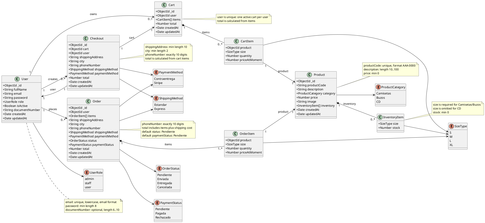

```plantuml
@startuml
left to right direction
skinparam classAttributeIconSize 0

class User {
  +ObjectId _id
  +String fullName
  +String email
  +String password
  +UserRole role
  +Boolean isActive
  +String documentNumber
  +Date createdAt
  +Date updatedAt
}

class Product {
  +ObjectId _id
  +String productCode
  +String description
  +ProductCategory category
  +Number price
  +String image
  +InventoryItem[] inventory
  +Date createdAt
  +Date updatedAt
}

class InventoryItem {
  +SizeType size
  +Number stock
}

class Cart {
  +ObjectId _id
  +ObjectId user
  +CartItem[] items
  +Number total
  +Date createdAt
  +Date updatedAt
}

class CartItem {
  +ObjectId product
  +SizeType size
  +Number quantity
  +Number priceAtMoment
}

class Checkout {
  +ObjectId _id
  +ObjectId cart
  +ObjectId user
  +String shippingAddress
  +String city
  +String phoneNumber
  +ShippingMethod shippingMethod
  +PaymentMethod paymentMethod
  +Number total
  +Date createdAt
  +Date updatedAt
}

class Order {
  +ObjectId _id
  +ObjectId user
  +OrderItem[] items
  +String shippingAddress
  +String city
  +String phoneNumber
  +ShippingMethod shippingMethod
  +PaymentMethod paymentMethod
  +OrderStatus status
  +PaymentStatus paymentStatus
  +Number total
  +Date createdAt
  +Date updatedAt
}

class OrderItem {
  +ObjectId product
  +SizeType size
  +Number quantity
  +Number priceAtMoment
}

enum UserRole {
  admin
  staff
  user
}

enum ProductCategory {
  Camisetas
  Buzos
  CD
}

enum SizeType {
  S
  M
  L
  XL
}

enum ShippingMethod {
  Estandar
  Express
}

enum PaymentMethod {
  Contraentrega
  Stripe
}

enum OrderStatus {
  Pendiente
  Enviada
  Entregada
  Cancelada
}

enum PaymentStatus {
  Pendiente
  Pagada
  Rechazado
}

Product "1" *-- "0..*" InventoryItem : inventory
Cart "1" *-- "0..*" CartItem : items
Order "1" *-- "1..*" OrderItem : items

User "1" --> "0..1" Cart : owns
User "1" --> "0..*" Checkout : creates
User "1" --> "0..*" Order : places
CartItem "1" --> "1" Product : product
Checkout "1" --> "1" Cart : cart
Checkout "1" --> "1" User : user
OrderItem "1" --> "1" Product : product

User --> UserRole
Product --> ProductCategory
InventoryItem --> SizeType
CartItem --> SizeType
OrderItem --> SizeType
Checkout --> ShippingMethod
Checkout --> PaymentMethod
Order --> ShippingMethod
Order --> PaymentMethod
Order --> OrderStatus
Order --> PaymentStatus

note right of User
  email: unique, lowercase, email format
  password: min length 8
  documentNumber: optional, length 6..10
end note

note right of Product
  productCode: unique, format AAA-0000
  description: length 10..100
  price: min 0
end note

note right of InventoryItem
  size is required for Camisetas/Buzos
  size is omitted for CD
  stock: min 0
end note

note right of Cart
  user is unique: one active cart per user
  total is calculated from items
end note

note right of Checkout
  shippingAddress: min length 10
  city: min length 2
  phoneNumber: exactly 10 digits
  total is calculated from cart items
end note

note right of Order
  phoneNumber: exactly 10 digits
  total includes items plus shipping cost
  default status: Pendiente
  default paymentStatus: Pendiente
end note
@enduml
```
